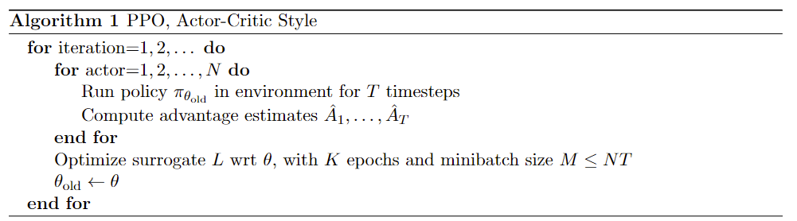

# 从头理解PPO，从代码到公式
[TOC]

## 1. 背景介绍
PPO算法（Proximal Policy Optimization Algorithms）于2017年由John Schulman提出，是一种基于策略优化的强化学习算法。PPO算法易于实现且在许多任务上取得了很好的效果，是目前强化学习领域的主流算法之一。PPO最主要的优点是
- 算法简单，易于实现，且在许多任务上取得了很好的效果。
- 允许对采样得到的数据进行多次利用，从而提高数据的利用效率，降低了样本复杂度（sample complexity）。
- 其优化目标对策略更新进行了约束，使得策略更新的幅度受到限制，从而避免了策略更新过大导致的性能下降或训练不稳定，这正是其名称中Proximal的含义。

类比于登山，每个箭头表示一次策略更新，箭头越长表示更新幅度越大。显然，黄色箭头式的小幅迭代更新更可能到达山顶。黄色代表稳重，粉红色代表冒险和激进。

## 2. 强化学习基本概念

强化学习中，智能体（Agent）通过与环境（Environment）的交互，观察环境的状态（State: $s_t$），执行动作（Action: $a_t$），获得奖励（Reward: $r_t$），从而学习到最优策略。强化学习的基本概念如下：
- 策略（Policy）：策略是在某个状态下选择动作的概率分布，通常用$\pi_\theta(a|s)$表示。
- 轨迹（Trajectory）：轨迹是从初始状态到终止状态的状态、动作、奖励序列，通常用$\tau = (s_0, a_0, r_0, s_1, a_1, r_1, \cdots)$表示。
- 回报（Return）：回报是在轨迹中获得的折算奖励的总和，通常用$R(\tau) = \sum_{t=0}^T \gamma^t r_t$表示。
- 价值函数（Value Function）：价值函数是状态$s$的期望回报，通常用$V(s)=\mathbb{E}_{\tau \sim \pi} [R(\tau) | s_0 = s]$表示。
- 动作价值函数（Action Value Function）：动作价值函数是在状态$s$下执行动作$a$的期望回报，通常用$Q(s, a)=\mathbb{E}_{\tau \sim \pi} [R(\tau) | s_0 = s, a_0 = a]$表示。
- 优势函数（Advantage Function）：优势函数是在状态$s$下执行动作$a$的期望回报相对于价值函数的差值，其朴素形式为$A(s, a) = Q(s, a) - V(s)$，后面我们会介绍Generalized Advantage Estimation。
## 3. PPO算法
### 3.1 优化目标 
首先我们令将要更新的策略和更新之前的策略的比值为$r_t(\theta) = \frac{\pi_{\theta}(a_t|s_t)}{\pi_{\theta_{old}}(a_t|s_t)}$，则PPO试图最大化的优化目标Clipped Surrogate Objective为：
$$
L^{CLIP}(\theta) = \mathbb{E}_{t} \left[ \min \left( r_t(\theta) A_t, \text{clip}(r_t(\theta), 1 - \epsilon, 1 + \epsilon) A_t \right) \right]
$$
我们对一个时间步的$\min \left( r_t(\theta) A_t, \text{clip}(r_t(\theta), 1 - \epsilon, 1 + \epsilon) A_t \right)$进行分析，可以得到下图：

当$A>0$时，最大化$L^{CLIP}$可以使$r$变大，对应于小红点从左下方向右上方移动，但是不会超过$1+\epsilon$；当$A<0$时，最大化$L^{CLIP}$可以使r变小，对应于小红点从右下方向左上方移动，但是不会超过$1-\epsilon$。这样，PPO算法就可以保证策略更新的幅度受到限制，总是不会超出旧策略$\pi_{\theta_{old}}$太远。为方便理解，我们也可以通过下表来展示上述结论：

| $r_t(\theta) > 0$ | $A_t$ | Return Value of $min$ | Objective is Clipped | Sign of Objective | Gradient |
|---|---|---|---|---|---|
| $r_t(\theta) \in [1 - \epsilon, 1 + \epsilon]$ | + | $r_t(\theta) A_t$ | no | + | ✓ |
| $r_t(\theta) \in [1 - \epsilon, 1 + \epsilon]$ | - | $r_t(\theta) A_t$ | no | - | ✓ |
| $r_t(\theta) < 1 - \epsilon$ | + | $r_t(\theta) A_t$ | no | + | ✓ |
| $r_t(\theta) < 1 - \epsilon$ | - | $(1 - \epsilon) A_t$ | yes | - | 0 |
| $r_t(\theta) > 1 + \epsilon$ | + | $(1 + \epsilon) A_t$ | yes | + | 0 |
| $r_t(\theta) > 1 + \epsilon$ | - | $r_t(\theta) A_t$ | no | - | ✓ |
### 3.2 算法流程
$L^{CLIP}$已经是理解PPO的核心了，除此之外，为了计算$A_t$我们需要价值函数$V_\theta(s_t)$，损失函数中要相应加入价值函数的损失项：$L_t^{VF}(\theta) = \mathbb{E}_t \left[ (V_{\theta}(s_t) - V_t^{targ})^2 \right]$。(原始论文中还有一个Entropy Bonus项，鼓励策略探索）。PPO算法的整体流程如下：

算法中假设我们可以跑N个actor，每个actor采样T个时间步，总共得到NT个时间步的数据。值得注意的是，由于PPO算法策略更新的幅度不大，可以多次利用采样得到的数据进行梯度更新(K epochs)，从而提高数据的利用效率，降低了样本复杂度。
关于优势函数$A_t$的计算，我们可以采用其朴素形式，也可以采用Generalized Advantage Estimation（GAE）的形式，介绍如下：
## 4. Generalized Advantage Estimation （选读）
## 5. 代码实现
### 5.1 CartPole
### 5.2 乒乓球
## 6. 理论联系
## 7. 总结

