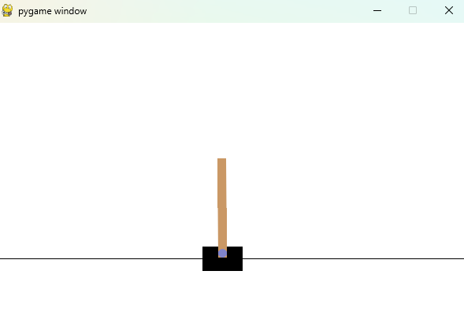

# 从头理解PPO，从公式到代码
[TOC]

## 1. 背景介绍
PPO算法（Proximal Policy Optimization Algorithms）于2017年由John Schulman提出，是一种基于策略优化的强化学习算法。PPO算法易于实现且在许多任务上取得了很好的效果，是目前强化学习领域的主流算法之一。PPO最主要的优点是：
- 算法简单，易于实现，且在许多任务上取得了很好的效果。
- 允许对采样得到的数据进行多次利用，从而提高数据的利用效率，降低了样本复杂度（sample complexity）。
- 其优化目标对策略更新进行了约束，使得策略更新的幅度受到限制，从而避免了策略更新过大导致的性能下降或训练不稳定，这正是其名称中Proximal的含义。


类比于登山，每个箭头表示一次策略更新，箭头越长表示更新幅度越大。显然，黄色箭头式的小幅迭代更新更可能到达山顶。黄色代表稳重，粉红色代表激进。

## 2. 强化学习基本概念


在进入正题前，我们先简要回顾下RL的基本概念。在强化学习中，智能体（Agent）通过与环境（Environment）交互，观察环境的状态（State: $s_t$），执行动作（Action: $a_t$），获得奖励（Reward: $r_t$），最终学习到最优策略。强化学习的基本概念如下：
- 策略（Policy）：策略是在某个状态下选择动作的概率分布，通常用$\pi_\theta(a|s)$表示。
- 轨迹（Trajectory）：轨迹是从初始状态到终止状态的状态、动作、奖励序列，通常用$\tau = (s_0, a_0, r_0, s_1, a_1, r_1, \cdots)$表示。
- 回报（Return）：回报是在轨迹中获得的折算奖励的总和，通常用$R(\tau) = \sum_{t=0}^T \gamma^t r_t$表示。
- 价值函数（Value Function）：价值函数是状态$s$的期望回报，通常用$V(s)=\mathbb{E}_{\tau \sim \pi} [R(\tau) | s_0 = s]$表示。
- 动作价值函数（Action Value Function）：动作价值函数是在状态$s$下执行动作$a$的期望回报，通常用$Q(s, a)=\mathbb{E}_{\tau \sim \pi} [R(\tau) | s_0 = s, a_0 = a]$表示。
- 优势函数（Advantage Function）：优势函数是在状态$s$下执行动作$a$的期望回报相对于价值函数的差值，其朴素形式为$A(s, a) = Q(s, a) - V(s)$，后面我们会介绍Generalized Advantage Estimation。
## 3. PPO算法
### 3.1 优化目标 
首先我们令将要更新的策略和更新之前的策略的比值为$r_t(\theta) = \frac{\pi_{\theta}(a_t|s_t)}{\pi_{\theta_{old}}(a_t|s_t)}$，则PPO试图最大化的优化目标Clipped Surrogate Objective为：
$$
L^{CLIP}(\theta) = \mathbb{E}_{t} \left[ \min \left( r_t(\theta) A_t, \text{clip}(r_t(\theta), 1 - \epsilon, 1 + \epsilon) A_t \right) \right]
$$
我们对一个时间步的$\min \left( r_t(\theta) A_t, \text{clip}(r_t(\theta), 1 - \epsilon, 1 + \epsilon) A_t \right)$进行分析，可以得到下图：


当$A>0$时，最大化$L^{CLIP}$可以使$r$变大，对应于小红点从左下方向右上方移动，但是不会超过$1+\epsilon$（超出部分发生截断）；当$A<0$时，最大化$L^{CLIP}$可以使$r$变小，对应于小红点从右下方向左上方移动，但是不会超过$1-\epsilon$（超出部分发生截断）。这样，PPO算法就可以保证策略更新的幅度受到限制，总是不会偏离旧策略$\pi_{\theta_{old}}$太远。为方便理解，我们也可以通过下表来展示上述结论：


| $r_t(\theta) > 0$ | $A_t$ | Return Value of $min$ | Objective is Clipped | Sign of Objective | Gradient |
|---|---|---|---|---|---|
| $r_t(\theta) \in [1 - \epsilon, 1 + \epsilon]$ | + | $r_t(\theta) A_t$ | no | + | ✓ |
| $r_t(\theta) \in [1 - \epsilon, 1 + \epsilon]$ | - | $r_t(\theta) A_t$ | no | - | ✓ |
| $r_t(\theta) < 1 - \epsilon$ | + | $r_t(\theta) A_t$ | no | + | ✓ |
| $r_t(\theta) < 1 - \epsilon$ | - | $(1 - \epsilon) A_t$ | yes | - | 0 |
| $r_t(\theta) > 1 + \epsilon$ | + | $(1 + \epsilon) A_t$ | yes | + | 0 |
| $r_t(\theta) > 1 + \epsilon$ | - | $r_t(\theta) A_t$ | no | - | ✓ |
### 3.2 算法流程
$L^{CLIP}$已经是理解PPO的核心了，除此之外，为了计算$A_t$我们需要价值函数$V_\theta(s_t)$，损失函数中要相应加入价值函数的损失项：$L_t^{VF}(\theta) = \mathbb{E}_t \left[ (V_{\theta}(s_t) - V_t^{targ})^2 \right]$，$V_t^{targ}$可以取为$\sum_{l=0}^{\infty} \gamma^l r_{t+l} $。(另外，原始论文中还有一个Entropy Bonus项，鼓励策略探索）。PPO算法的整体流程如下：


算法中假设我们可以跑N个actor，每个actor采样T个时间步，总共得到NT个时间步的数据。值得注意的是，由于PPO算法策略更新的幅度不大，可以多次利用采样得到的数据进行梯度更新($K$ epochs)，从而提高数据的利用效率，降低了样本复杂度。
关于优势函数$A_t$的计算，我们可以采用其朴素形式，也可以采用Generalized Advantage Estimation（GAE）的形式，介绍如下：
## 4. Generalized Advantage Estimation
记TD residual为$\delta_t^{V} = r_t + \gamma V(s_{t+1}) - V(s_t)$，我们可以得到$k$时间步展开的优势函数$\hat{A}_t^{(k)}$：
$$
\begin{align*}
\hat{A}_t^{(1)} &:= \delta^{V}_t &&= -V(s_t) + r_t + \gamma V(s_{t+1}) \\
\hat{A}_t^{(2)} &:= \delta^{V}_t + \gamma \delta^{V}_{t+1} &&= -V(s_t) + r_t + \gamma r_{t+1} + \gamma^2 V(s_{t+2}) \\
\hat{A}_t^{(3)} &:= \delta^{V}_t + \gamma \delta^{V}_{t+1} + \gamma^2 \delta^{V}_{t+2} &&= -V(s_t) + r_t + \gamma r_{t+1} + \gamma^2 r_{t+2} + \gamma^3 V(s_{t+3}) \\
& \vdots \\
\hat{A}_t^{(k)} &:= \sum_{l=0}^{k-1} \gamma^l \delta^{V}_{t+l} &&= -V(s_t) + r_t + \gamma r_{t+1} + \dots + \gamma^{k-1} r_{t+k-1} + \gamma^k V(s_{t+k}) \\
\hat{A}_t^{(\infty)} &:= \sum_{l=0}^{\infty} \gamma^l \delta^{V}_{t+l} &&= -V(s_t) + \sum_{l=0}^{\infty} \gamma^l r_{t+l},
\end{align*} 
$$
对这些项取指数加权平均，我们即得到GAE的表达式：

$$
\begin{align*}
\hat{A}_t^{\text{GAE}(\gamma, \lambda)} &:= (1 - \lambda) \left( \hat{A}_t^{(1)} + \lambda \hat{A}_t^{(2)} + \lambda^2 \hat{A}_t^{(3)} + \dots \right) \\
&= (1 - \lambda) \left( \delta^{V}_t + \lambda (\delta^{V}_t + \gamma \delta^{V}_{t+1}) + \lambda^2 (\delta^{V}_t + \gamma \delta^{V}_{t+1} + \gamma^2 \delta^{V}_{t+2}) + \dots \right) \\
&= (1 - \lambda) \left( \delta^{V}_t (1 + \lambda + \lambda^2 + \dots) + \gamma \delta^{V}_{t+1} (\lambda + \lambda^2 + \lambda^3 + \dots) \right. \\
& \qquad \left. + \gamma^2 \delta^{V}_{t+2} (\lambda^2 + \lambda^3 + \lambda^4 + \dots) + \dots \right) \\
&= (1 - \lambda) \left( \delta^{V}_t \left( \frac{1}{1 - \lambda} \right) + \gamma \delta^{V}_{t+1} \left( \frac{\lambda}{1 - \lambda} \right) + \gamma^2 \delta^{V}_{t+2} \left( \frac{\lambda^2}{1 - \lambda} \right) + \dots \right) \\
&= \sum_{l=0}^{\infty} (\gamma \lambda)^l \delta^{V}_{t+l}
\end{align*}
$$

## 5. 代码实现
我们用一个python文件实现了完整的PPO算法，GAE的计算，`mlp`，`cnn`，离散及连续动作的actor，以及CartPole和乒乓球两个游戏的学习及动画效果，仅依赖pytorch和gymnasium(gym)，总共400多行代码：https://github.com/schinger/PPO-simplest

策略为actor，价值函数为critic，我们用神经网络`mlp`或`cnn`来拟合这两个函数，合为`ac`。用类`PPOBuffer`来存储采样数据（轨迹），计算GAE及回报。`ppo`算法实现为一个函数。Policy Loss为：
```python
pi, logp = ac.pi(obs, act)
ratio = torch.exp(logp - logp_old)
clip_adv = torch.clamp(ratio, 1-clip_ratio, 1+clip_ratio) * adv
loss_pi = -(torch.min(ratio * adv, clip_adv)).mean()
```

Value Function Loss 为：
```python
((ac.v(obs) - ret)**2).mean()
```
### 5.1 CartPole


这是一个连续动作actor的例子，我们采用高斯分布`GaussianActor`来建模动作分布，将标准差对角化并将其对数设为模型的参数 `log_std`，用神经网络去预测均值`mu_net`。用CPU训练几分钟即可完全掌握这个游戏。


### 5.2 乒乓球


这是一个离散动作actor的例子，我们采用softmax分布`CategoricalActor`来建模动作分布。这个例子从像素点开始学习，我们利用类`FramePreStacking`来将连续的n帧图像堆叠起来，预处理得到类似位置，速度，加速度等信息（用差分来近似），然后用CNN网络`cnn`来进一步提取特征。用GPU训练几小时即可击败内置AI。
### 5.3 Vanilla Policy Gradients
另外附上一个Vanilla Policy Gradients的实现，仅基于numpy，手工计算梯度，共一百来行代码，供参考：https://github.com/schinger/pong_actor-critic
### 5.4 RLHF: PPO on LLM
近年来PPO的大火主要是因为LLM中RLHF（Reinforcement Learning from Human Feedback）首先应用的是PPO，我们也实现了训练LLama的PPO算法，仅依赖于pytorch，不调用其他包：https://github.com/schinger/FullLLM
。

然而值得指出的是，PPO算法并不是在所有场景下都是最优的，比如在LLM中，有[研究指出](https://arxiv.org/abs/2410.01257)，Vanilla Policy Gradients（Reinforce）在LLM中[表现更好](https://arxiv.org/abs/2402.14740)。
## 6. 理论联系
PPO源于对[TRPO](https://arxiv.org/pdf/1502.05477)的简化。在TRPO这篇论文中，作者先推导出了一个理论上保证期望回报单调递增的策略迭代算法（即，论文中的Algorithm 1），然后经过参数化和近似，得到了约束目标的采样估计，最后，经过重要性采样估计（Importance Sampling Estimator)，用$q$表示采样分布，得到下式：
$$
\sum_a \pi_\theta(a|s_n) A_{\theta_{\text{old}}}(s_n, a) = \mathbb{E}_{a \sim q} \left[ \frac{\pi_\theta(a|s_n)}{q(a|s_n)} A_{\theta_{\text{old}}}(s_n, a) \right]
$$
如果另$q = \pi_{\theta_{\text{old}}}$，再将TRPO的KL约束条件简化为PPO的Clip约束，即可得到PPO算法，所以PPO是TRPO的简化（trick of clip function），它避免了TRPO中复杂的约束优化问题 （need to use the conjugate gradient algorithm (Hessian-vector products) followed by a line search），在主流机器学习框架中易于实现，所以流传更广。

另外，我们可以从梯度的视角来看待PPO算法与vanilla policy gradients的关系。在vanilla policy gradients中，策略梯度为：
$$
\hat{g} = {\mathbb{E}}_t \left[ \nabla_\theta \log \pi_\theta(a_t | s_t) {A}_t \right] = {\mathbb{E}}_t \left[  \frac{\nabla_\theta \pi_\theta(a_t | s_t)}{\pi_\theta(a_t | s_t)} {A}_t \right]
$$
不带clip的PPO算法的梯度为：
$$
\hat{g} = \nabla_\theta \mathbb{E}_t \left[ \frac{\pi_\theta(a_t|s_t)}{\pi_{\theta_{\text{old}}}(a_t|s_t)} A_t \right] = \mathbb{E}_t \left[ \frac{\nabla_\theta \pi_\theta(a_t|s_t)}{\pi_{\theta_{\text{old}}}(a_t|s_t)} A_t \right]
$$
两者在$\pi_\theta(a_t|s_t) = \pi_{\theta_{\text{old}}}(a_t|s_t)$时相等。但是在$\pi_\theta(a_t|s_t) \neq \pi_{\theta_{\text{old}}}(a_t|s_t)$，且二者向超过一定的分歧迈进时，PPO的梯度会被置零（见上文表格），即避免了策略更新的幅度过大，提高了训练的稳定性。


